[Inicio](/README.md)

# Creación de tableros de control con Looker Studio de Google

# 📘 Tablero de control con Looker Studio de Google

> Documento técnico que permita adherir los lineamientos de administración de los tableros de control necesarios para la correcta administración de elementos DATAVIZ Usando [Looker Studio de Google](https://lookerstudio.google.com/navigation/reporting).

---

## 1️⃣ Creación de cuenta de Google y Acceso

Looker Studio de Google es una plataforma web para la construcción, administración y despliegue de tableros de control basados en múltiples fuentes de datos. Su uso requiere obligatoriamente una cuenta de Google para la autenticación y la gestión de recursos. Para la implementación de los tableros asociados al proyecto, se propone la creación de una cuenta de Google dedicada, la cual funcionará como entidad administradora y propietaria de todos los informes y conexiones configuradas. Esta cuenta será entregada al cliente como parte del entregable final, garantizando la continuidad operativa, la transferencia de propiedad de los activos creados y la capacidad de administración posterior por parte del cliente.

Al ingresar al portal de [Looker Studio de Google](https://lookerstudio.google.com/navigation/reporting) utilizando la cuenta previamente configurada para la administración de los tableros, se presenta la pantalla principal del entorno de trabajo:

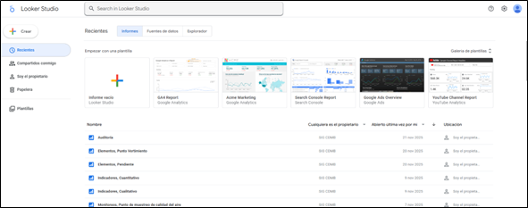

Desde esta interfaz, al seleccionar el botón “Crear”, se despliega un menú con las opciones disponibles para iniciar nuevos recursos dentro de la plataforma, tales como:

- Informe (Report): para construir tableros interactivos.

- Fuente de datos (Data Source): para configurar conexiones a bases de datos o archivos.

- Explorador (Explorer): para análisis ad hoc de datasets.

La visualización de estas opciones se muestra en la siguiente imagen:

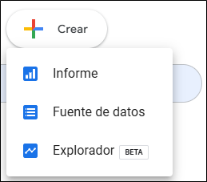

## 2️⃣ Creación de fuentes de datos

Para la construcción de tableros en Looker Studio es necesario, en primera instancia, definir y configurar las fuentes de datos que alimentarán los diferentes reportes. Looker Studio admite múltiples tipos de conectores, incluyendo:

- Conexiones a bases de datos corporativas (BigQuery, PostgreSQL, MySQL, SQL Server, entre otras), mediante autenticación directa o a través de credenciales de servicio.

- Archivos planos como CSV, Excel, JSON o Google Sheets.

- APIs y servicios externos, mediante conectores nativos o personalizados.

- Conectores propietarios de Google, como Google Analytics, Google Ads o Google Cloud Storage.

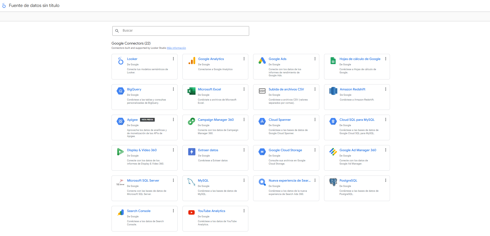

Cada fuente de datos debe configurarse definiendo el método de autenticación, el esquema de tablas o campos disponibles y los permisos de acceso necesarios, con el fin de garantizar la integridad y disponibilidad de la información consumida por los tableros.

### Conexión a una base de datos relacional

En este documento se presentará un ejemplo de configuración de una fuente de datos conectada a una base de datos operada en PostgreSQL.

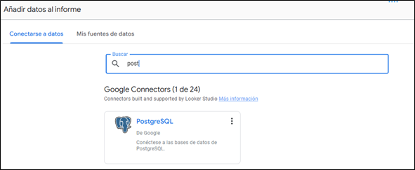

Al seleccionar este conector, Looker Studio despliega un formulario para la configuración de la conexión hacia el servidor de base de datos. Los parámetros que deben diligenciarse incluyen:

- Host: dirección del servidor donde reside la base de datos.

- Puerto: puerto TCP utilizado por el servicio PostgreSQL (generalmente 5432).

- Base de datos: nombre de la instancia o esquema de trabajo.

- Usuario y contraseña: credenciales con permisos de lectura sobre las tablas requeridas.

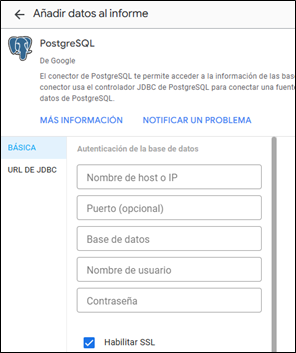

Adicionalmente, se recomienda habilitar la opción “SSL” para establecer una conexión cifrada. Al activar esta opción, el sistema solicitará adjuntar el certificado SSL del servidor, con el fin de garantizar la autenticidad y seguridad del canal de comunicación.

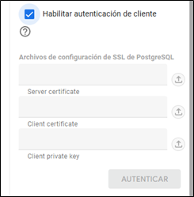

Una vez diligenciados todos los campos de conexión, se debe hacer clic en el botón “Autenticar”. Si las credenciales y parámetros son válidos, Looker Studio habilitará en el panel derecho un menú de configuración adicional, desde el cual es posible seleccionar:

- Una tabla específica dentro de la base de datos, o

- Definir una consulta SQL personalizada para controlar exactamente los campos, filtros y uniones que se desean exponer al tablero.

Para este caso de uso, se selecciona la opción de consulta SQL personalizada, debido a que Looker Studio únicamente detecta de forma automática las tablas y vistas ubicadas en el esquema public. Mediante la opción de consulta SQL, es posible acceder a cualquier tabla o vista perteneciente a otros esquemas de la base de datos, permitiendo mayor flexibilidad en la definición de la fuente de datos. Esto se ilustra en la siguiente imagen:

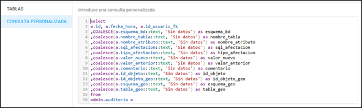

Al utilizar consultas SQL para crear fuentes de datos en Looker Studio, se recomienda seguir las siguientes prácticas para garantizar rendimiento, seguridad y mantenibilidad:

#### Recomendaciones en el uso de consultas personalizadas

1. Limitar los campos seleccionados

    Evitar el uso de SELECT *.
    En su lugar, especificar únicamente las columnas necesarias para el tablero:

        SELECT fecha, valor, categoria
        FROM datos.mediciones

2. Filtrar en el origen siempre que sea posible

    Incluir filtros en la consulta SQL, cuando corresponda, para minimizar la cantidad de datos transferidos:

3. Evitar operaciones pesadas en la consulta

    Operaciones como JOIN complejos, GROUP BY sobre grandes volúmenes o funciones de ventana pueden afectar el rendimiento del tablero.

    Si se requiere procesar datos:

    Preferir vistas materializadas.

    O preparar los datos previamente en la base de datos.

4. Asignar un usuario con permisos mínimos

    La conexión debe realizarse con un usuario de solo lectura, con permisos exclusivamente sobre las tablas o vistas necesarias para el tablero.

5. Validar continuamente el rendimiento

    Si la fuente de datos se vuelve lenta:

    Usar EXPLAIN en PostgreSQL para identificar cuellos de botella.

    Optimizar índices en la base de datos.

    Reducir campos o filas innecesarias.

6. Evitar exponer datos sensibles

    Nunca incluir columnas con información personal o confidencial a menos que sea estrictamente necesario y conforme a políticas de seguridad.

Construcción del reporte en Looker Studio

Una vez configurada la fuente de datos, se procede a la creación del reporte (dashboard) donde se visualizarán los indicadores, gráficos y elementos analíticos requeridos. Looker Studio proporciona un entorno de diseño interactivo basado en componentes configurables, permitiendo construir informes dinámicos y conectados directamente a las fuentes de datos previamente definidas.

## 3️⃣ Creación de un nuevo reporte

Desde la pantalla principal de Looker Studio:

Hacer clic en “Crear” → “Informe”.

Seleccionar la fuente de datos creada en el paso anterior.

Confirmar la vinculación haciendo clic en “Agregar al informe”.

Esto abrirá el lienzo principal donde se construirá el tablero, habilitando todas las herramientas de diseño y configuración.

### Configuración del lienzo y estructura del tablero

Antes de agregar visualizaciones, se recomienda configurar:

- Tamaño de página (Automático, Carta, Pantalla 16:9, etc.)

- Fondo, colores corporativos y tipografías

- Encabezado, pie de página y secciones

- Contenedores o cuadrículas para una alineación uniforme

Esto facilita la organización y mantiene la consistencia visual del informe.

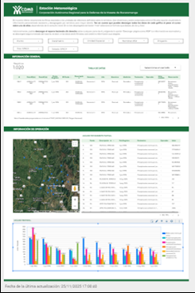

### Inserción de elementos visuales

Looker Studio permite agregar múltiples tipos de visualizaciones:

- Gráficos de líneas, barras, columnas, áreas y dispersión

- Tablas y tablas dinámicas

- Mapas geoespaciales

- Contadores, tarjetas de KPI e indicadores

- Series temporales

- Controles interactivos como filtros, segmentadores y controles de fecha

Cada visualización puede asociarse a uno o varios campos provenientes de la fuente de datos.

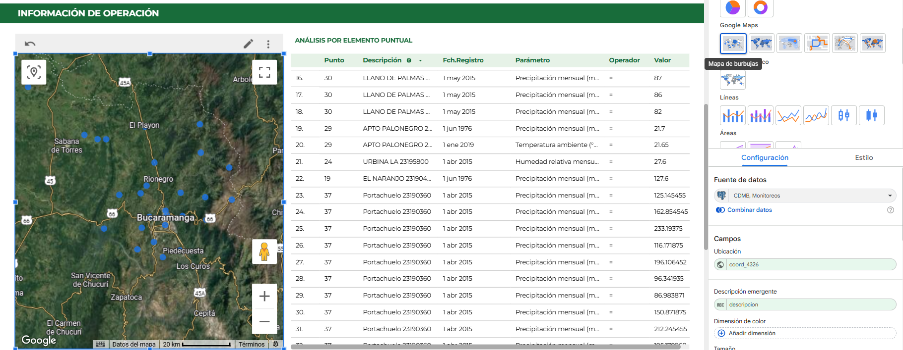

Para utilizar visualizaciones basadas en mapas dentro de Looker Studio, es indispensable que la fuente de datos incluya un campo de tipo ubicación geográfica. Este campo debe contener la latitud y longitud expresadas en formato numérico, separadas por una coma (por ejemplo: 4.6533, -74.0836). Looker Studio utiliza este valor para geocodificar los registros y representarlos correctamente sobre el mapa.

### Configuración de métricas y dimensiones

Para cada componente gráfico se deben definir:

- Dimensiones (categorías, atributos descriptivos)

- Métricas (valores numéricos agregados)

- Tipo de agregación (SUM, COUNT, AVG, MAX, MIN)

- Filtros locales o globales

- Ordenamientos y límites de filas

También es posible crear campos calculados usando funciones matemáticas, lógicas o de texto.

### Diseño de la interacción del reporte

Looker Studio permite configurar la interacción entre elementos mediante:

- Filtros cruzados (clic sobre un gráfico → filtra los demás)

- Segmentación por fecha o rangos dinámicos

- Parámetros personalizables ingresados por el usuario

- Vinculación con otras páginas del informe (navegación interna)

Esto permite construir reportes exploratorios y no solo informes estáticos.

### Pruebas y validación de datos

Antes de publicar:

- Revisar que todos los gráficos muestran los valores esperados.

- Validar que los filtros funcionan correctamente.

- Verificar que los campos calculados generan resultados coherentes.

- Ajustar consultas SQL si se detectan inconsistencias en los datos.

- Validar el comportamiento en modo “Ver” (simulación del usuario final).

### Publicación y gestión de acceso

Finalmente, para poner el tablero a disposición de usuarios:

- Hacer clic en “Compartir” → “Compartir informe”

- Configurar permisos:

- Lectura (usuario final)

- Edición (equipo de BI o administradores)

- Establecer si el informe es público, privado o accesible mediante enlaces restringidos

- Definir método de actualización y programar refrescos si la fuente lo permite

## 4️⃣ Cambio de la fuente de datos de un reporte

Looker Studio permite reemplazar la fuente de datos asociada a un reporte sin necesidad de reconstruir todas las visualizaciones. Este mecanismo es útil cuando se requiere intercambiar entre una base de datos corporativa (PostgreSQL) y un archivo plano (CSV, XLSX, Google Sheets), o viceversa, manteniendo la estructura del tablero.

### 4.1 Consideraciones previas al cambio de fuente

Antes de realizar el reemplazo, es importante garantizar que la nueva fuente de datos cumpla con las siguientes condiciones:

- Contenga los mismos nombres de campos o equivalentes funcionales.

- Utilice tipos de datos compatibles (texto, numéricos, fecha, geográficos).

- Mantenga la misma granularidad y estructura básica (por ejemplo, un registro por medición).

- Si existen métricas calculadas, asegurar que los campos utilizados estén presentes en la nueva fuente.

- Si la estructura difiere, Looker Studio marcará errores en los gráficos y requerirá ajustes manuales.

### 4.2 Procedimiento para reemplazar la fuente de datos

Abrir el reporte en Looker Studio.

- Ir al menu de opciones superior derecha y hacer una copia del reporte
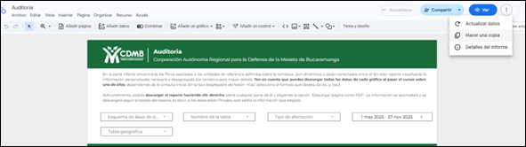

- Seleccionar una nueva fuente existente o crear una nueva:
Archivo plano (CSV, XLSX, Google Sheets).
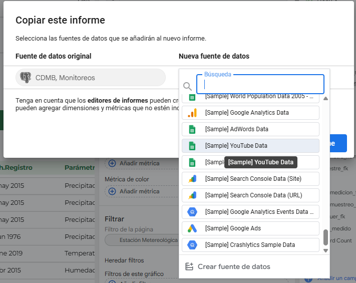

- Confirmar la copia

Looker Studio actualizará automáticamente todas las visualizaciones que utilicen campos con nombres coincidentes.

### 4.3 Validación posterior al reemplazo

Después de cambiar la fuente de datos se debe:

- Revisar que todas las visualizaciones se hayan actualizado correctamente.

- Verificar métricas, filtros y campos calculados.

- Confirmar que los mapas funcionen correctamente (ubicaciones válidas).

- Validar que las fechas y números estén en el formato esperado.

Looker Studio indicará con advertencias cualquier visualización que requiera ajustes.

### 4.4 Recomendaciones de mejores prácticas

- Mantener consistencia en el nombre de los campos entre fuentes.

- Evitar caracteres especiales o espacios en los encabezados.

## 5️⃣ 🔁 Transferencia de propiedad de los tableros en Google Looker Studio

La transferencia de propiedad de los tableros creados en Google Looker Studio puede realizarse mediante dos mecanismos principales:

### 5.1 Creación de una copia del reporte por parte del cliente

El usuario destinatario puede acceder a las URL del tablero, crear una copia y debe:

- Configurar nuevamente las fuentes de datos, apuntando al servidor donde se alojará la base de datos del cliente.

- Validar que los conectores (archivos planos, PostgreSQL, BigQuery, etc.) queden correctamente autorizados.

Para más información, consulte la documentación oficial sobre cómo [copiar reportes en Looker Studio](https://docs.cloud.google.com/looker/docs/studio/copy-a-report?hl=es&visit_id=639003276452898511-2962819325&rd=1#zippy=%2Csecciones-de-este-art%C3%ADculo).

### 5.2 Transferencia directa de propiedad desde la administración del reporte

Desde la configuración del reporte, el administrador puede:

- Compartir el informe con un usuario que posea una cuenta de Google (Gmail o Google Workspace).
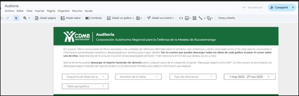

- Asignar permisos de Editor.

- Cambiar la propiedad del reporte seleccionando la opción “Transferir propiedad”.
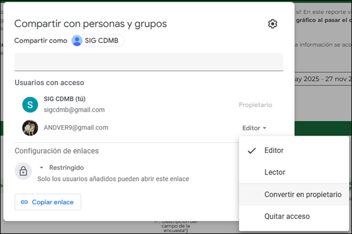

Una vez completado este proceso, el nuevo propietario tendrá control total del tablero y de las fuentes de datos asociadas, siempre y cuando dichas fuentes también se transfieran o se reconfiguren adecuadamente.

